# A Survey of the State of the Practice for Research Software in the United States

Jeffrey C. Carver, Nicholas Weber, Karthik Ram, Sandra Gesing, and Daniel S. Katz

This repository contains code to generate all the figures in the paper *A Survey of the State of the Practice for Research Software in the United States* currently in review. 

### Figure 1
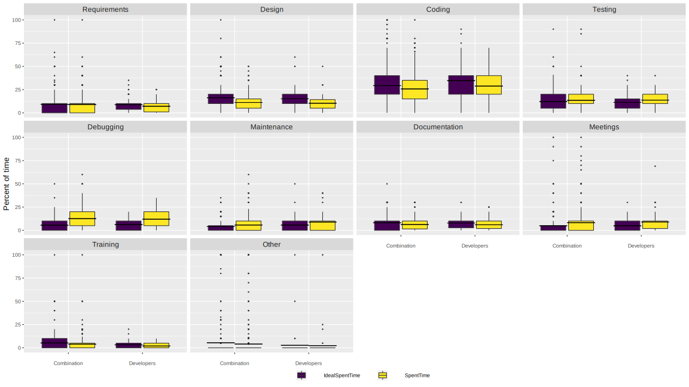

### Figure 2
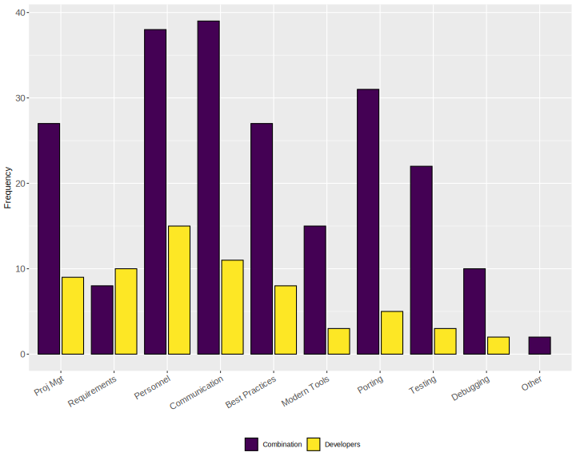

### Figure 3
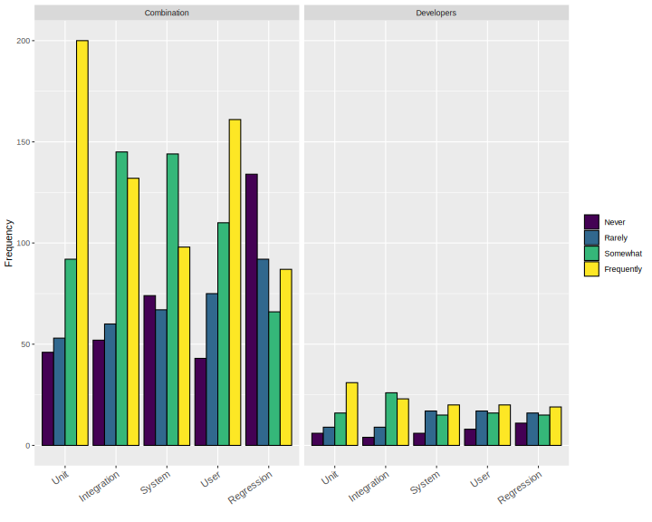

### Figure 4
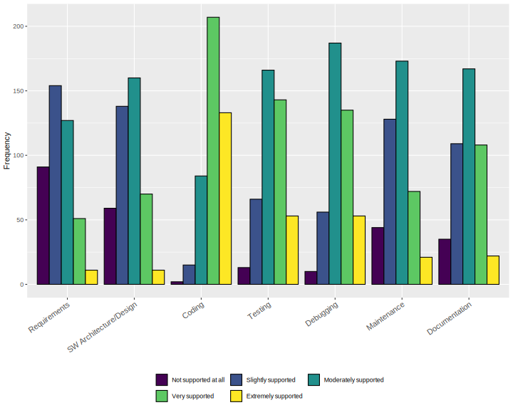

### Figure 5

### Figure 6
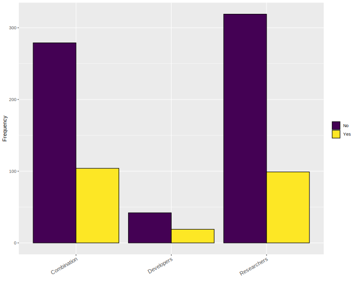

### Figure 7
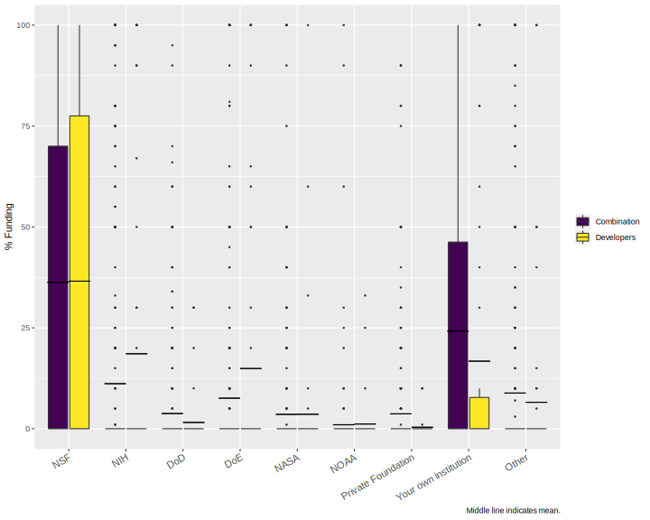

### Figure 8
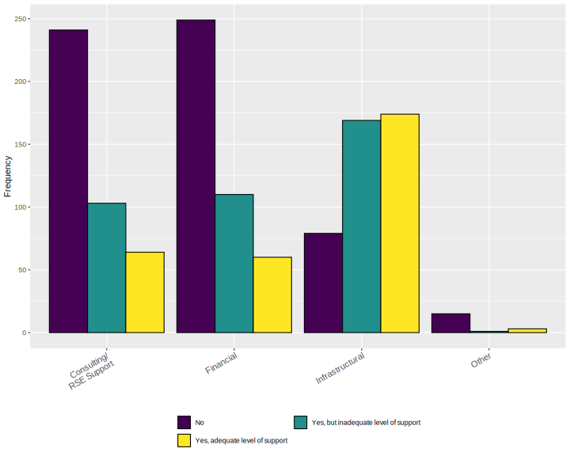

### Figure 9
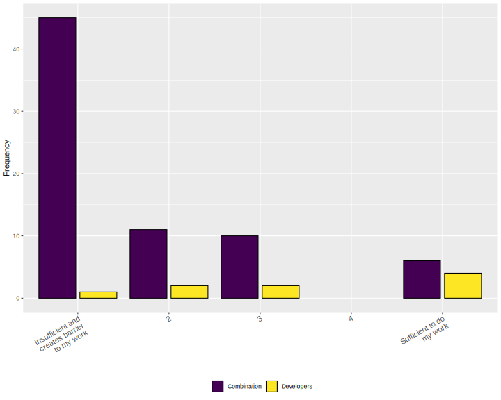

### Figure 10
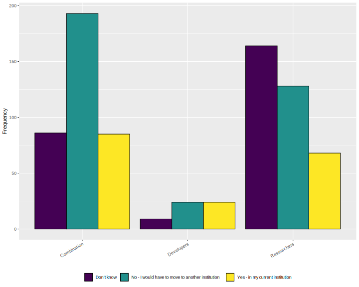

### Figure 11
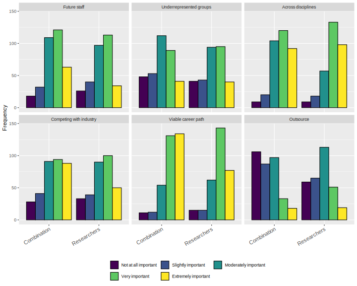

### Figure 12
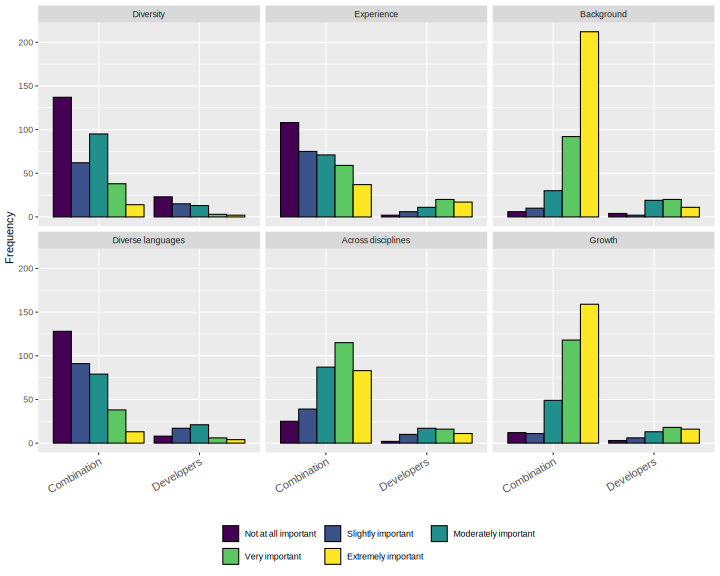

### Figure 13
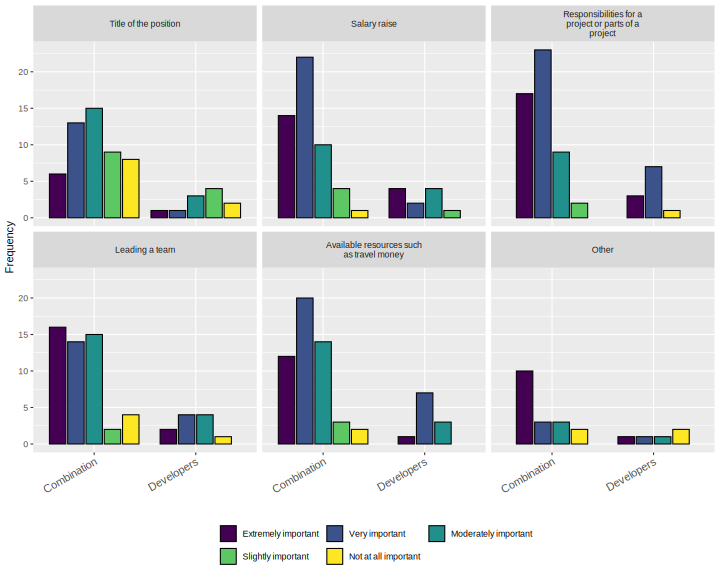

### Figure 14
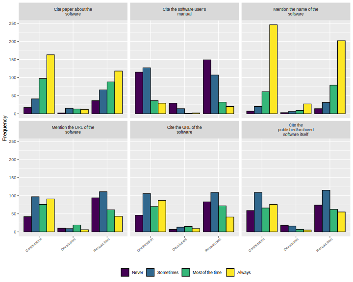

### Figure 15
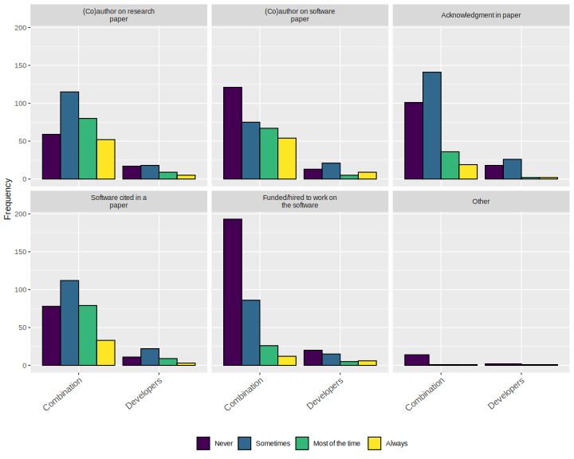

### Figure 16
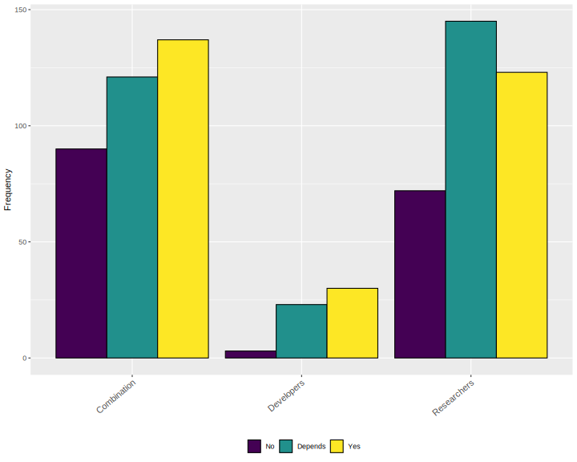

### Figure 17
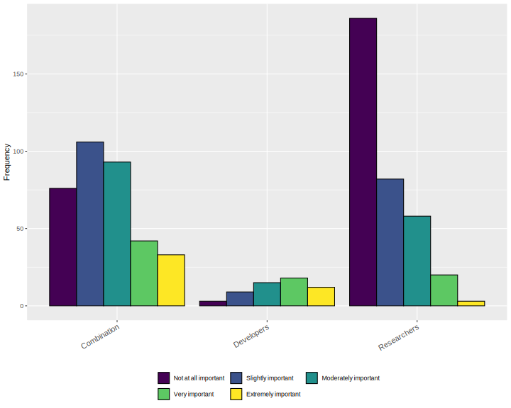

### Figure 18
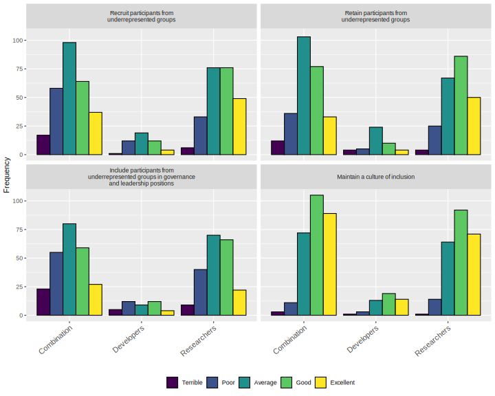

### Figure 19
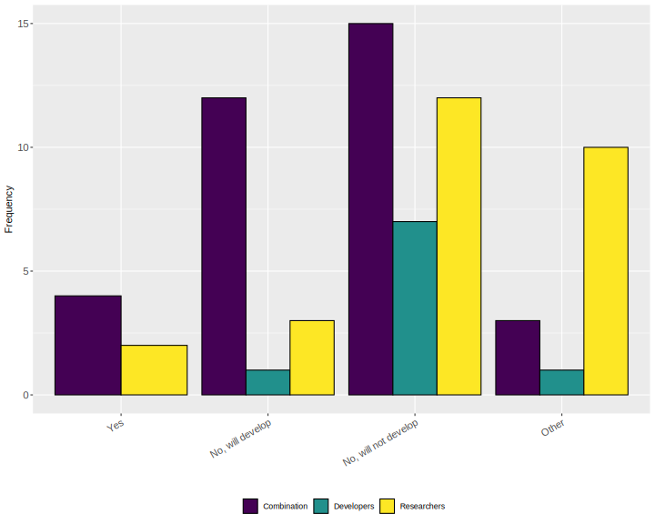

### Figure 20
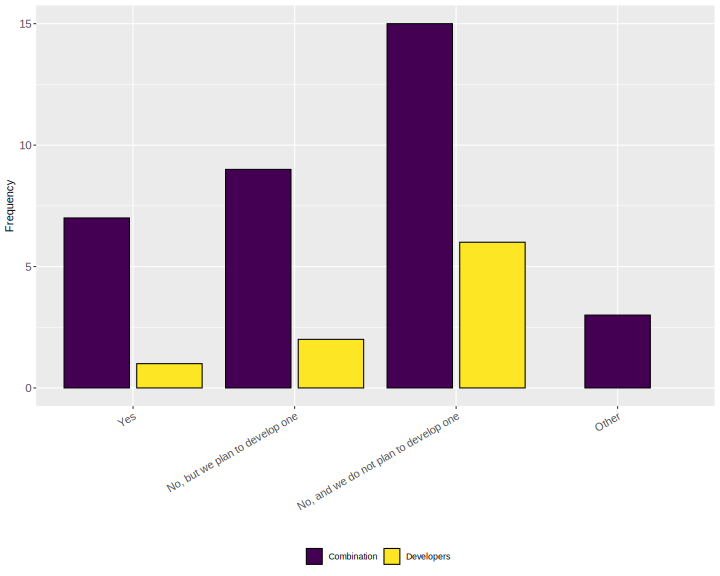

### Figure 21

